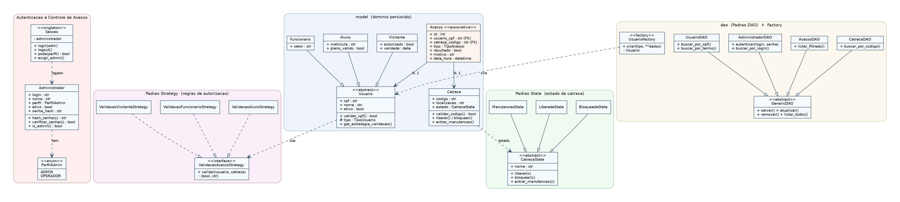

# Sistema de Catraca Eletrônica

Projeto Final de **Linguagem de Programação Orientada a Objetos (LPOO)** — Bacharelado em Ciência da Computação — 2026/1
Professora: Vanessa Lago Machado
Autor: Lucas Imig Cantú

---

## 1. Descrição geral do sistema

O **Sistema de Catraca Eletrônica** é uma aplicação de controle de acesso físico (pensada para um contexto de academia/instituição) que gerencia **usuários**, **catracas**, **acessos** e os **administradores do próprio sistema**.

O fluxo central é a **simulação de um acesso**: ao informar o CPF de um usuário e o código de uma catraca, o sistema decide se a passagem é **autorizada** ou **negada**, aplicando regras específicas conforme o tipo de usuário e o estado atual da catraca. **Toda tentativa** — autorizada ou negada — é persistida no histórico, permitindo auditoria posterior com filtros.

Funcionalidades:

- **Login obrigatório** com dois perfis de acesso (ADMIN / OPERADOR).
- Cadastro completo (CRUD) de **Usuários** (Aluno, Funcionário, Visitante) e **Catracas**.
- Tela de **listagem com busca/filtro** (usuários por nome/CPF; histórico de acessos por resultado e CPF).
- **Validações** de dados na interface: CPF com dígitos verificadores reais e código de catraca no formato `CAT-NN`.
- **Simulação de acesso** que combina o estado da catraca + a estratégia do usuário.
- **Histórico de acessos** completo, com filtros por resultado e por CPF.
- **Gerência de administradores** (cadastrar/alterar/remover operadores, alterar perfil ou senha).
- Tela Sobre com as informações do sistema e do autor.

---

## 2. Controle de Acesso — o que é ADMIN

A aplicação exige autenticação na entrada. Cada administrador possui um **perfil**:

| Perfil       | Pode acessar                                                                  |
|--------------|--------------------------------------------------------------------------------|
| **ADMIN**    | **Tudo**: Cadastros (Usuários, Catracas), Operação (Simular Acesso, Histórico), **Administração** (gerenciar outros admins/operadores) e Ajuda. |
| **OPERADOR** | Apenas a **Operação** (Simular Acesso e Histórico) e a Ajuda.                  |

Em outras palavras, são restritas **apenas ao perfil ADMIN**:

- O menu **Cadastros** (CRUD de Usuários e CRUD de Catracas, incluindo a transição para Manutenção).
- O menu **Administração** (CRUD dos próprios administradores e operadores).

A operação cotidiana da catraca (validar uma passagem e consultar o histórico) é liberada para qualquer perfil autenticado. Como o `OPERADOR` representa o atendente que apenas opera o ponto de acesso, ele não consegue alterar cadastros de usuários, catracas ou outros operadores — isso é prerrogativa do `ADMIN`.

O controle é feito em duas camadas:

1. **Na interface**: a janela principal **não desenha** os menus restritos quando o usuário corrente é OPERADOR, e os métodos `_abrir_*` validam o perfil novamente caso sejam disparados por outra via.
2. **No controller**: os métodos administrativos chamam `sessao_atual.exigir_admin()`, que levanta `PermissionError` se a sessão não tiver perfil ADMIN.

A sessão é representada pelo singleton `model.sessao.sessao_atual`, que guarda o `Administrador` autenticado. Senhas nunca são armazenadas em texto puro: ficam apenas como hash **SHA-256** na coluna `adm_senha`.

### Credenciais padrão

O `schema.sql` semeia um administrador inicial para o primeiro acesso:

| Login   | Senha      | Perfil |
|---------|------------|--------|
| `admin` | `admin123` | ADMIN  |

Após o primeiro login, **troque a senha** (Administração → Editar) e cadastre outros operadores conforme a necessidade.

---

## 3. Arquitetura

Organização **MVC + DAO** exigida no enunciado, separada por responsabilidade:

```
SistemaCatraca_LPOO/
├── model/      # Entidades de domínio + padrões State/Strategy/Factory + Sessao
├── dao/        # Camada de persistência (PostgreSQL) com CRUD + schema.sql
├── control/    # Controladores que mediam a comunicação entre view e dao
├── view/       # Interface gráfica em Tkinter (login + janela principal + telas)
└── main.py     # Ponto de entrada
```

### Entidades persistidas (4 tabelas, com relacionamento por chaves estrangeiras)

| Classe          | Tabela                | Chave                 | Observação                                                       |
|-----------------|-----------------------|-----------------------|------------------------------------------------------------------|
| `Administrador` | `tb_administradores`  | `adm_login` (UK)      | Autenticável; perfil ADMIN ou OPERADOR. Senha em SHA-256.        |
| `Usuario`       | `tb_usuarios`         | `usu_cpf`             | Abstrata; especializada em `Aluno`, `Funcionario` e `Visitante`. |
| `Catraca`       | `tb_catracas`         | `cat_codigo`          | Estado controlado pelo padrão State.                             |
| `Acesso`        | `tb_acessos`          | `ace_id` (serial)     | **Entidade associativa N–N** entre usuário e catraca.           |

O relacionamento entre as tabelas do domínio é implementado com **chaves estrangeiras**: `tb_acessos.usu_cpf → tb_usuarios.usu_cpf` e `tb_acessos.cat_codigo → tb_catracas.cat_codigo` (ambas com `ON DELETE RESTRICT`, protegendo o histórico).

---

## 4. Padrões de projeto aplicados

Foram aplicados **quatro** padrões (o enunciado exige no mínimo dois, sendo o DAO obrigatório):

1. **DAO** *(obrigatório)* — `dao/`. `GenericDAO` (abstrata) define o contrato CRUD; `AdministradorDAO`, `UsuarioDAO`, `CatracaDAO` e `AcessoDAO` implementam o acesso ao PostgreSQL.
2. **Factory** — `model/usuario.py` (`UsuarioFactory`). Reconstrói a subclasse correta de `Usuario` a partir do tipo persistido.
3. **State** — `model/estados_catraca.py`. A `Catraca` delega seu comportamento ao estado atual (`BloqueadaState`, `LiberadaState`, `ManutencaoState`).
4. **Strategy** — `model/validacao_strategy.py`. Cada tipo de usuário fornece sua própria regra de autorização:
   - **Aluno:** ativo + plano válido + horário 06h–23h.
   - **Funcionário:** ativo (24h).
   - **Visitante:** ativo + autorizado + horário 08h–18h.

---

## 5. Interface gráfica

A interface usa **Tkinter** com o tema `ttk.clam` e uma paleta de cores centralizada em `view/estilos.py`:

- **Cabeçalho colorido** em todas as janelas, com título e subtítulo.
- **Botões nomeados por intenção** (Primary, Success, Danger) com hover.
- **Tabelas zebradas** (linhas alternadas) com cabeçalhos destacados.
- **Cards de conteúdo** (fundo branco) sobre o fundo cinza-azulado.
- **Barra de status** na janela principal mostrando o operador logado e seu perfil.

A tela de login é a primeira janela exibida; só após autenticação a janela principal é aberta, com os menus **gateados pelo perfil**.

---

## 6. Diagrama de classes



> Imagem gerada pelo autor (`docs/diagrama_classes.dot` → Graphviz). O diagrama destaca o modelo de domínio (com a entidade associativa `Acesso`), o subsistema de autenticação (Administrador, PerfilAdmin, Sessao) e os quatro padrões de projeto.

---

## 7. Instruções de execução

### Pré-requisitos
- **Python 3.10+**
- **PostgreSQL** em execução
- **Tkinter** (em Linux: `sudo apt install python3-tk`)

### Passo 1 — Dependências Python
```bash
pip install -r requirements.txt
```

### Passo 2 — Criar o banco e o esquema
```bash
createdb lpoo_projeto_catraca
psql -d lpoo_projeto_catraca -f dao/schema.sql
```

O script cria as 4 tabelas e **semeia o administrador padrão** (`admin` / `admin123`).

### Passo 3 — Configurar a conexão (opcional)
A conexão usa estes valores padrão, sobrescritíveis por variáveis de ambiente:

| Variável     | Padrão                  |
|--------------|-------------------------|
| `DB_HOST`    | `localhost`             |
| `DB_PORT`    | `5432`                  |
| `DB_NAME`    | `lpoo_projeto_catraca`  |
| `DB_USER`    | `postgres`              |
| `DB_PASSWORD`| `postgres`              |

### Passo 4 — Executar
```bash
python main.py
```

Faça login com `admin` / `admin123`. A janela principal abre com o menu de navegação adequado ao seu perfil. Troque a senha pelo menu **Administração → Administradores → Editar**.

### Passo 5 (opcional) — Popular o banco com dados de exemplo

O script `seed_data.py` insere administradores, catracas e usuários de teste (alunos, funcionários e visitantes com situações variadas — ativos, inativos, planos vencidos, validades futuras). É **idempotente**: pode ser rodado mais de uma vez sem duplicar nada.

```bash
python seed_data.py
```

### Passo 6 (opcional) — Simular o uso diário

O script `simular_uso_diario.py` gera **uma tentativa de passagem a cada segundo**, escolhendo aleatoriamente um usuário, uma catraca e um sentido (ENTRADA/SAIDA). Cada tentativa é validada de verdade — passa pelos padrões **State** (estado da catraca) e **Strategy** (regra por tipo de usuário) — e é gravada no histórico, exatamente como um uso real do sistema.

```bash
python simular_uso_diario.py
```

O simulador imprime cada tentativa em tempo real com horário e resultado (✔ autorizado / ✘ negado, com o motivo). **Encerre com Ctrl+C** para ver as estatísticas (total de tentativas, percentual de autorizações, motivos de negação mais frequentes).

Enquanto o simulador roda, abra a aplicação (`python main.py`) e vá em *Operação → Histórico de Acessos* para acompanhar o banco crescendo em tempo real.

---

## 8. Documentação do Projeto

Os artefatos de análise e projeto (APS — Parte 1) estão em **[Documentação do Projeto.md](Documentação%20do%20Projeto.md)**.

---

## 9. Declaração de uso de IA

Este projeto foi desenvolvido com o auxílio de **Inteligência Artificial (Claude, da Anthropic)**, utilizada nas seguintes partes:

- Revisão do código das camadas `model`, `dao`, `control` e `view`.
- Implementação do controle de acesso por perfil (ADMIN/OPERADOR) com autenticação e gating de menus.
- Cybersegurança do armazenamento das senhas de ADMIN.
- Estilização da interface (tema ttk, paleta, cabeçalhos, tabelas zebradas).

Todo o código gerado foi revisado, testado contra um banco PostgreSQL real e adaptado pelo autor.
